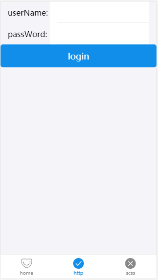
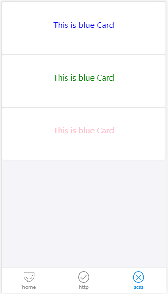

# react-ant-mobile

[](https://github.com/facebook/react)
[](https://mobile.ant.design/index-cn)
[](https://github.com/zeit/next.js)

本人新手第一次搭脚手架还需大神多多指点


## 特性

-   基于[react](https://github.com/facebook/react)，[ant-mobile](https://mobile.ant.design/index-cn)，[Next.js](https://github.com/zeit/next.js)，[Redux](https://github.com/reactjs/redux) web-mobile服务端渲染最佳实践。
-   基于Ant Mobile UI ，手机webapp服务端渲染的最佳实践脚手架。
-   通过NodeJs反向代理解决了跨域问题。

## 如何运行
	```bash
	npm install
	npm run dev
	打开 http://localhost:3000
	```

## 构建与运行

	```bash
	npm run build
	npm start
	```

## 开发构建

### 目录结构

```bash
├── /actions/           # redux action
│ ├── home.js		# home.js
│ ├── http.js		# http.js
├── /api/		# http 请求
├── /components/	# 组件
│ │ ├── Layout.js	# 国际化
│ │ ├── MenuBar.js	# 底部导航
├── /components/	# 组件
│ │ ├── _document.js    # http模板
│ │ ├── home.js		# home.js
│ │ ├── http.js		# http.js
│ │ ├── index.js	# 入口文件
│ │ ├── scss.js		# scss.js
├── /reducers/		# redux reducers
│ │ ├── index.js	# reducers 入口文件
│ │ ├── home.js		# home.js
│ │ ├── http.js		# http.js
├── /static/		# static
├── /styles/		# styles scss文件夹
├── package.json	# 项目信息
├── next.config.js	# next.js的webpack配置
├── postcss.config.js	# next.js的scss配置
├── server.js		# node server 反向代理也在其中配置
├── store.js		# redux 配置
├── .babelrc		# babelrc配置
└── .gitignore		# gitignore配置
```
## 错误
如果在 npm install 时候报错很有可能是安装node-sass报错。
执行下面的命令即可
npm install node-sass --registry=https://registry.npm.taobao.org

## 截屏






